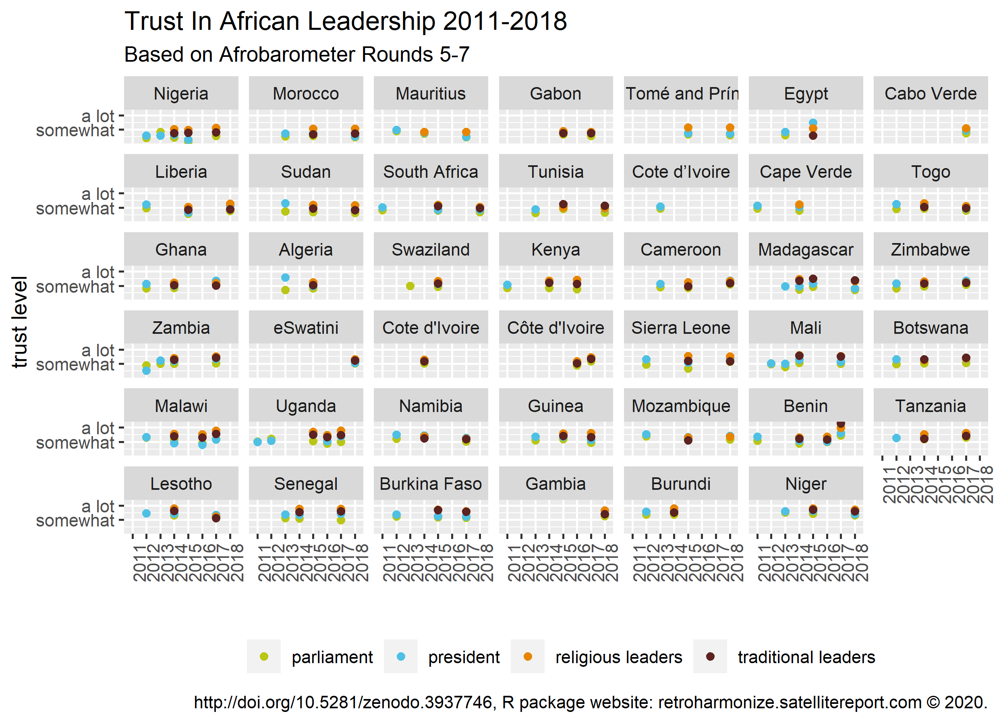

# Case Study: Working With Afrobarometer surveys

The goal of this case study is to explore the variation in trust in
various state institutions among African societies, as well as changes
in trust over time.

To do this, we use data from
[Afrobarometer](https://www.afrobarometer.org/data/), a cross-national
survey project measuring attitudes and opinions about democracy, the
economy and society in African countries based on general population
samples. Currently, seven rounds of the Afrobarometer are available,
covering the period between 1999 and 2019.

`retroharmonize` is not affiliated with Afrobarometer. To fully
reproduce this example, you must acquire the data files from them, which
is free of charge. Afrobarometer data is protected by copyright. Authors
of any published work based on Afrobarometer data or papers are required
to acknowledge the source, including, where applicable, citations to
data sets posted on this website. Please acknowledge the copyright
holders in all publications resulting from its use by means of
bibliographic citation in this form:

In this vignette, we harmonize data from rounds [Afrobarometer Data
Round 5 (all
countries)](https://www.afrobarometer.org/survey-resource/merged-round-5-data-34-countries-2015/),
[Afrobarometer Data Round 6 (all
countries)](https://www.afrobarometer.org/survey-resource/merged-round-6-codebook-36-countries-2016/)
and [Afrobarometer Data Round 7 (all
countries)](https://www.afrobarometer.org/survey-resource/merged-round-7-data-34-countries-2019/).
Some elements of the vignette are not “live”, because we want to avoid
re-publishing the original microdata files from Afrobarometer, but you
can access the data directly from the [www.afrobarometer.org
website](https://www.afrobarometer.org/).

File names (to identify file versions):  
Round 5:
`merged-round-5-data-34-countries-2011-2013-last-update-july-2015.sav`  
Round 6: `merged_r6_data_2016_36countries2.sav`  
Round 7: `r7_merged_data_34ctry.release.sav`

For reproducibility, we are storing only a small subsample from the
files and the metadata. We assume that you extracted and copied all
`.sav` files into a single folder that we will call in this vignette the
`afrobarometer_dir`. Define your `afrobarometer_dir` with
[`file.path()`](https://rdrr.io/r/base/file.path.html) in your own
system.

## Importing Afrobarometer Files

We start by reading in the three rounds of the Afrobarometer.

``` r

library(retroharmonize)
library(dplyr)
library(tidyr)
```

``` r

### use here your own directory
ab <- dir(afrobarometer_dir, pattern = "sav$")
afrobarometer_rounds <- file.path(afrobarometer_dir, ab)

ab_waves <- read_surveys(afrobarometer_rounds, .f = "read_spss")
```

Let’s give a bit more meaningful identifiers than the file names:

``` r

attr(ab_waves[[1]], "id") <- "Afrobarometer_R5"
attr(ab_waves[[2]], "id") <- "Afrobarometer_R6"
attr(ab_waves[[3]], "id") <- "Afrobarometer_R7"
```

We can review if the main descriptive metadata is correctly present with
[`document_surveys()`](https://ropengov.github.io/retroharmonize/reference/document_surveys.md).

``` r

documented_ab_waves <- document_surveys(ab_waves)
```

``` r

print(documented_ab_waves)
#> # A tibble: 3 × 5
#>   id               filename                               ncol  nrow object_size
#>   <chr>            <chr>                                 <int> <int>       <dbl>
#> 1 Afrobarometer_R5 merged-round-5-data-34-countries-201…   349 51587   159027592
#> 2 Afrobarometer_R6 merged_r6_data_2016_36countries2.sav    365 53935   172064576
#> 3 Afrobarometer_R7 r7_merged_data_34ctry.release.sav       367 45823   148759488
```

Create a metadata table, or a data map, that contains information about
the variable names and labels, and where each row correspnds to one
variable in the survey data file. We do this with the function
[`metadata_survey_create()`](https://ropengov.github.io/retroharmonize/reference/metadata_survey_create.md),
which extracts the metadata from the survery data files, normalizes
variable labels, identifies ranges of substantive responses and missing
value codes. Its wrapper,
[`metadata_create()`](https://ropengov.github.io/retroharmonize/reference/metadata_create.md),
loops the function on a list of surveys, or on a set of files containing
surveys.

``` r

ab_metadata <- metadata_create(survey_list = ab_waves)
```

## Working with metadata

From the metadata file we select only those rows that correspond to the
variables that we’re interested in: the `rowid` being the unique case
identifier, `DATEINTR` with the interview date, `COUNTRY` containing
information about the country where the interview was conducted,
`REGION` with the region (sub-national unit) where the interview was
conducted, and `withinwt` being the weighting factor.

Further, we select all variables that have the word “trust” in the
normalized variable label.

For these variables, we create normalized variable names (`var_name`)
and labels (`var_label`).

``` r

library(dplyr)
to_harmonize <- ab_metadata %>%
  filter(var_name_orig %in%
    c("rowid", "DATEINTR", "COUNTRY", "REGION", "withinwt") |
    grepl("trust ", label_orig)) %>%
  mutate(var_label = var_label_normalize(label_orig)) %>%
  mutate(var_label = case_when(
    grepl("^unique identifier", var_label) ~ "unique_id",
    TRUE ~ var_label
  )) %>%
  mutate(var_name = val_label_normalize(var_label))
```

To further reduce the size of the analysis, we only choose a few
variables based on the normalized variable names (`var_name`).

``` r

to_harmonize <- to_harmonize %>%
  filter(
    grepl("president|parliament|religious|traditional|unique_id|weight|country|date_of_int", var_name)
  )
```

The resulting table with information about the variables selected for
harmonization looks as follows:

``` r

head(to_harmonize %>%
  select(all_of(c("id", "var_name", "var_label"))), 10)
#>                  id                                             var_name
#> 1  Afrobarometer_R5                                            unique_id
#> 2  Afrobarometer_R5                                              country
#> 3  Afrobarometer_R5                                    date_of_interview
#> 4  Afrobarometer_R5 trust_key_leadership_figure_president_prime_minister
#> 5  Afrobarometer_R5                   trust_parliament_national_assembly
#> 6  Afrobarometer_R5                      within_country_weighting_factor
#> 7  Afrobarometer_R6                                            unique_id
#> 8  Afrobarometer_R6                                              country
#> 9  Afrobarometer_R6                                    date_of_interview
#> 10 Afrobarometer_R6                                      trust_president
#>                                               var_label
#> 1                                             unique_id
#> 2                                               country
#> 3                                     date of interview
#> 4  trust key leadership figure president prime minister
#> 5                    trust parliament national assembly
#> 6                       within country weighting factor
#> 7                                             unique_id
#> 8                                               country
#> 9                                     date of interview
#> 10                                      trust president
```

The
[`merge_surveys()`](https://ropengov.github.io/retroharmonize/reference/merge_surveys.md)
function harmonizes the variable names, the variable labels and survey
identifiers and returns a list of surveys (of class
[`survey()`](https://ropengov.github.io/retroharmonize/reference/survey.md).)
The parameter `var_harmonization` must be a list or a data frame that
contains at least the original file name (`filename`), original variable
names (`var_name_orig`), the new variable names (`var_name`) and their
labels (`var_label`), so that the program knows which variables to take
from what files and how to call and label them after transformation.

``` r

merged_ab <- merge_surveys(
  survey_list = ab_waves,
  var_harmonization = to_harmonize
)

# country will be a character variable, and doesn't need a label
merged_ab <- lapply(merged_ab,
  FUN = function(x) {
    x %>%
      mutate(country = as_character(country))
  }
)
```

Review the most important metadata with
[`document_surveys()`](https://ropengov.github.io/retroharmonize/reference/document_surveys.md):

``` r

documenteded_merged_ab <- document_surveys(merged_ab)
```

``` r

print(documenteded_merged_ab)
#> # A tibble: 3 × 5
#>   id               filename                               ncol  nrow object_size
#>   <chr>            <chr>                                 <int> <int>       <dbl>
#> 1 Afrobarometer_R5 merged-round-5-data-34-countries-201…     6 51587    11570496
#> 2 Afrobarometer_R6 merged_r6_data_2016_36countries2.sav      8 53935     8652392
#> 3 Afrobarometer_R7 r7_merged_data_34ctry.release.sav         8 45823     7353968
```

## Harmonization

In the Afrobarometer trust is measured with four-point ordinal rating
scales. Such data are best analyzed with ordinal models, which do not
assume that the points are equidistant. However, to get a quick idea of
how the data look like, we will assign numbers 0-3, with 0 corresponding
to the least trust, and 3 corresponding to the most trust, and for the
time-being analyze the data as if they were metric.

To review the harmonization on a single survey use
[`pull_survey()`](https://ropengov.github.io/retroharmonize/reference/pull_survey.md).
Here we select Afrobarometer Round 6.

``` r

R6 <- pull_survey(merged_ab, id = "Afrobarometer_R6")
```

``` r

attributes(R6$trust_president[1:20])
#> $labels
#>                          Missing                       Not at all 
#>                               -1                                0 
#>                    Just a little                         Somewhat 
#>                                1                                2 
#>                            A lot Don’t know/ Haven't heard enough 
#>                                3                                9 
#>                          Refused 
#>                               98 
#> 
#> $label
#> [1] "trust president"
#> 
#> $Afrobarometer_R6_name
#> [1] "."
#> 
#> $Afrobarometer_R6_values
#> -1  0  1  2  3  9 98 
#> -1  0  1  2  3  9 98 
#> 
#> $Afrobarometer_R6_label
#> [1] "Q52a. Trust president"
#> 
#> $Afrobarometer_R6_labels
#>                          Missing                       Not at all 
#>                               -1                                0 
#>                    Just a little                         Somewhat 
#>                                1                                2 
#>                            A lot Don’t know/ Haven't heard enough 
#>                                3                                9 
#>                          Refused 
#>                               98 
#> 
#> $id
#> [1] "Afrobarometer_R6"
#> 
#> $class
#> [1] "retroharmonize_labelled_spss_survey" "haven_labelled_spss"                
#> [3] "haven_labelled"
```

The
[`document_survey_item()`](https://ropengov.github.io/retroharmonize/reference/document_survey_item.md)
function shows the metadata of a single variable.

``` r

document_survey_item(R6$trust_president)
#> $code_table
#> # A tibble: 7 × 5
#>   values Afrobarometer_R6_values labels           Afrobarometer_R6_lab…¹ missing
#>    <dbl>                   <dbl> <chr>            <chr>                  <lgl>  
#> 1     -1                      -1 Missing          Missing                FALSE  
#> 2      0                       0 Not at all       Not at all             FALSE  
#> 3      1                       1 Just a little    Just a little          FALSE  
#> 4      2                       2 Somewhat         Somewhat               FALSE  
#> 5      3                       3 A lot            A lot                  FALSE  
#> 6      9                       9 Don’t know/ Hav… Don’t know/ Haven't h… FALSE  
#> 7     98                      98 Refused          Refused                FALSE  
#> # ℹ abbreviated name: ¹​Afrobarometer_R6_labels
#> 
#> $history_var_name
#>                  name Afrobarometer_R6_name 
#>  "R6$trust_president"                   "." 
#> 
#> $history_var_label
#>                   label  Afrobarometer_R6_label 
#>       "trust president" "Q52a. Trust president" 
#> 
#> $history_na_range
#> character(0)
#> 
#> $history_id
#> [1] "Afrobarometer_R6"
```

Afrobarometer’s SPSS files do not mark the missing values, so we have to
be careful. The set of labels that are identified as missing:

``` r

collect_na_labels(to_harmonize)
#> [1] "Not asked"
```

The set of valid category labels and missing value labels are as
follows:

``` r

collect_val_labels(to_harmonize %>%
  filter(grepl("trust", var_name)))
#>  [1] "Missing"                          "Not at all"                      
#>  [3] "Just a little"                    "Somewhat"                        
#>  [5] "A lot"                            "Don't know/Haven't heard enough" 
#>  [7] "Refused"                          "Don’t know/ Haven't heard enough"
#>  [9] "Don't know/ Haven't heard enough" "Not Asked in this Country"       
#> [11] "Not Asked in Country"             "Don’t know/Haven’t heard enough" 
#> [13] "Not asked in the country"
```

We create a harmonization function from the
[`harmonize_values()`](https://ropengov.github.io/retroharmonize/reference/harmonize_values.md)
prototype function. In fact, this is just a re-setting the default
values of the original function. It makes future reference in pipelines
easier, or it can be used for a question block only, in this case to
variables with `starts_with("trust")`.

``` r

harmonize_ab_trust <- function(x) {
  label_list <- list(
    from = c(
      "^not", "^just", "^somewhat",
      "^a", "^don", "^ref", "^miss", "^not", "^inap"
    ),
    to = c(
      "not_at_all", "little", "somewhat",
      "a_lot", "do_not_know", "declined", "inap", "inap",
      "inap"
    ),
    numeric_values = c(0, 1, 2, 3, 99997, 99998, 99999, 99999, 99999)
  )

  harmonize_values(
    x,
    harmonize_labels = label_list,
    na_values = c(
      "do_not_know" = 99997,
      "declined" = 99998,
      "inap" = 99999
    )
  )
}
```

We apply this function to the trust variables. The `harmonize_surveys()`
function binds all variables that are present in all surveys.

``` r

harmonized_ab_waves <- harmonize_surveys(
  survey_list = merged_ab,
  .f = harmonize_ab_trust
)
```

Let’s look at the attributes of `harmonized_ab_waves`.

``` r

h_ab_structure <- attributes(harmonized_ab_waves)
```

``` r

h_ab_structure$row.names <- NULL # We have over 100K row names
h_ab_structure
#> $names
#> [1] "date_of_interview"                                   
#> [2] "unique_id"                                           
#> [3] "country"                                             
#> [4] "within_country_weighting_factor"                     
#> [5] "trust_key_leadership_figure_president_prime_minister"
#> [6] "trust_parliament_national_assembly"                  
#> [7] "trust_president"                                     
#> [8] "trust_traditional_leaders"                           
#> [9] "trust_religious_leaders"                             
#> 
#> $class
#> [1] "tbl_df"     "tbl"        "data.frame"
#> 
#> $id
#> [1] "Waves: Afrobarometer_R5; Afrobarometer_R6; Afrobarometer_R7"
#> 
#> $filename
#> [1] "Original files: merged-round-5-data-34-countries-2011-2013-last-update-july-2015.sav; merged_r6_data_2016_36countries2.sav; r7_merged_data_34ctry.release.sav"
```

Let’s add the year of the interview:

``` r

harmonized_ab_waves <- harmonized_ab_waves %>%
  mutate(year = as.integer(substr(as.character(
    date_of_interview
  ), 1, 4)))
```

To keep our example manageable, we subset the datasets to include only
five countries.

``` r

harmonized_ab_waves <- harmonized_ab_waves %>%
  filter(country %in% c(
    "Niger", "Nigeria", "Algeria",
    "South Africa", "Madagascar"
  ))
```

## Analyzing the harmonized data

The harmonized data can be exported and analyzed in another statistical
program. The labelled survey data is stored in
[`labelled_spss_survey()`](https://ropengov.github.io/retroharmonize/reference/labelled_spss_survey.md)
vectors, which is a complex class that retains metadata for
reproducibility. Most statistical R packages do not know it. The data
should be presented either as numeric data with
[`as_numeric()`](https://ropengov.github.io/retroharmonize/reference/labelled_spss_survey_coercion.md)
or as categorical with
[`as_factor()`](https://ropengov.github.io/retroharmonize/reference/labelled_spss_survey_coercion.md).
(See more why you should not fall back on the more generic
[`as.factor()`](https://rdrr.io/r/base/factor.html) or
[`as.numeric()`](https://rdrr.io/r/base/numeric.html) methods in [The
labelled_spss_survey class
vignette.](https://retroharmonize.dataobservatory.eu/articles/labelled_spss_survey.html))

Please note that the numeric form of these trust variables is not
directly comparable with the numeric averages of the Eurobarometer trust
variables, because the middle of the range is at 1.5 and not 0.5.

``` r

harmonized_ab_waves %>%
  mutate_at(
    vars(starts_with("trust")),
    ~ as_numeric(.) * within_country_weighting_factor
  ) %>%
  select(-all_of("within_country_weighting_factor")) %>%
  group_by(country, year) %>%
  summarize_if(is.numeric, mean, na.rm = TRUE)
#> # A tibble: 17 × 7
#> # Groups:   country [5]
#>    country    year trust_key_leadership…¹ trust_parliament_nat…² trust_president
#>    <chr>     <int>                  <dbl>                  <dbl>           <dbl>
#>  1 Algeria    2013                   2.59                   1.70          NaN   
#>  2 Algeria    2015                 NaN                      1.82            2.00
#>  3 Madagasc…  2013                   1.96                 NaN             NaN   
#>  4 Madagasc…  2014                 NaN                      1.75            1.95
#>  5 Madagasc…  2015                 NaN                      1.94            2.15
#>  6 Madagasc…  2018                 NaN                      1.71            1.83
#>  7 Niger      2013                   2.59                   2.52          NaN   
#>  8 Niger      2015                 NaN                      2.43            2.64
#>  9 Niger      2018                 NaN                      2.31            2.42
#> 10 Nigeria    2012                   1.59                   1.43          NaN   
#> 11 Nigeria    2013                   1.59                   1.84          NaN   
#> 12 Nigeria    2014                 NaN                      1.45            1.64
#> 13 Nigeria    2015                 NaN                      1.15            1.30
#> 14 Nigeria    2017                 NaN                      1.57            2.06
#> 15 South Af…  2011                   2.04                   1.84          NaN   
#> 16 South Af…  2015                 NaN                      1.82            1.87
#> 17 South Af…  2018                 NaN                      1.70            1.86
#> # ℹ abbreviated names: ¹​trust_key_leadership_figure_president_prime_minister,
#> #   ²​trust_parliament_national_assembly
#> # ℹ 2 more variables: trust_traditional_leaders <dbl>,
#> #   trust_religious_leaders <dbl>
```

And the factor representation, without weighting:

``` r

library(tidyr) ## tidyr::pivot_longer()
harmonized_ab_waves %>%
  select(-all_of("within_country_weighting_factor")) %>%
  mutate_if(is.labelled_spss_survey, as_factor) %>%
  pivot_longer(starts_with("trust"),
    names_to  = "institution",
    values_to = "category"
  ) %>%
  mutate(institution = gsub("^trust_", "", institution)) %>%
  group_by(country, year, institution, category) %>%
  summarize(n = n())
#> `summarise()` has regrouped the output.
#> ℹ Summaries were computed grouped by country, year, institution, and category.
#> ℹ Output is grouped by country, year, and institution.
#> ℹ Use `summarise(.groups = "drop_last")` to silence this message.
#> ℹ Use `summarise(.by = c(country, year, institution, category))` for
#>   per-operation grouping (`?dplyr::dplyr_by`) instead.
#> # A tibble: 311 × 5
#> # Groups:   country, year, institution [85]
#>    country  year institution                                    category       n
#>    <chr>   <int> <chr>                                          <fct>      <int>
#>  1 Algeria  2013 key_leadership_figure_president_prime_minister little        75
#>  2 Algeria  2013 key_leadership_figure_president_prime_minister somewhat     341
#>  3 Algeria  2013 key_leadership_figure_president_prime_minister a_lot        759
#>  4 Algeria  2013 key_leadership_figure_president_prime_minister do_not_kn…    13
#>  5 Algeria  2013 key_leadership_figure_president_prime_minister inap          16
#>  6 Algeria  2013 parliament_national_assembly                   little       317
#>  7 Algeria  2013 parliament_national_assembly                   somewhat     419
#>  8 Algeria  2013 parliament_national_assembly                   a_lot         95
#>  9 Algeria  2013 parliament_national_assembly                   do_not_kn…   131
#> 10 Algeria  2013 parliament_national_assembly                   inap         242
#> # ℹ 301 more rows
```

We subsetted the datasets to meet the vignette size limitations. If you
are following our code without reducing the number of countries, you get
the following results:


